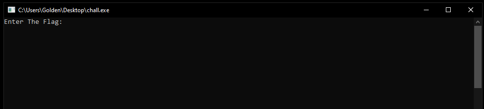
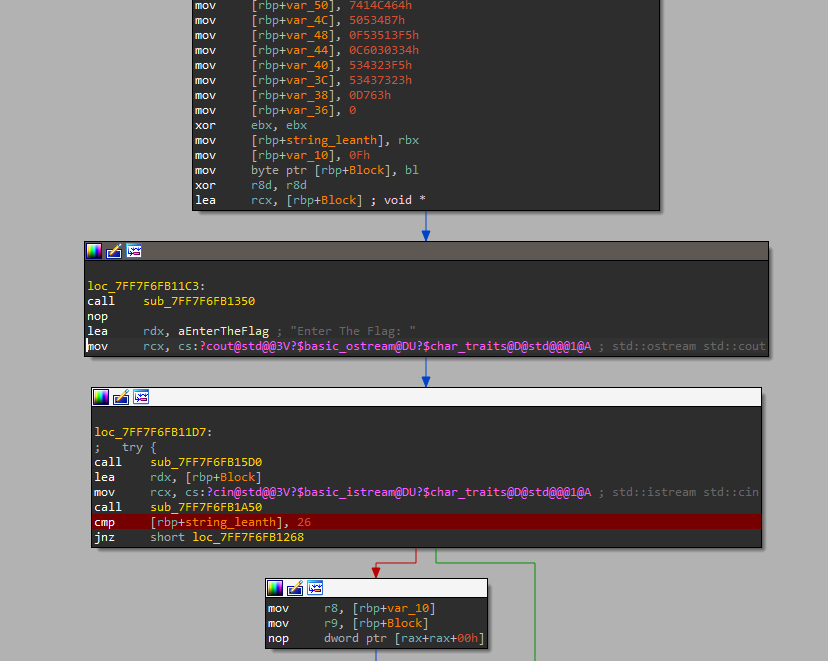
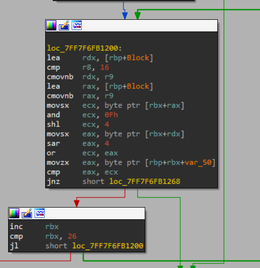

#Easy Peasy 

This was not so easy one, on running it this appear

on entering random flag it terminates

putting in **ida_pro** and search for this **"Enter The Flag"** and sit break point there

 

the first step after entring the flag is counting it's characters and compare them with **26** if they are more or less the program ends
if they are 26 then the Check starts

this loop easly make some masking to the bits to swap the least significant two bits then it compare with **eax** which stores the desired value

now you only need to debug the program with any debugger, you can use **x64dbg**, Icontenued with **ida** 
the next step is just to patch the **jnz** to **jz** and enter any 26 flag 
then make another breakpoint at this jump and check the eax value 
then easly you swap the most right two bits to get 
**[46 c4 41 47 7b 43 50 50 5f 31 53 5f 43 30 39 6c f5 32 34 35 32 37 34 35 36 7d]**
translating this hex to assci you get 
**"FLAG{CPP_1S_C00l_24527456}"**
but this not the flag form so the flag is 
**0xL4ugh{CPP_1S_C00l_24527456}**

### Tools used :

- **IDAFREE-7.7**

#### Written by

# *Karim Gomaa*
