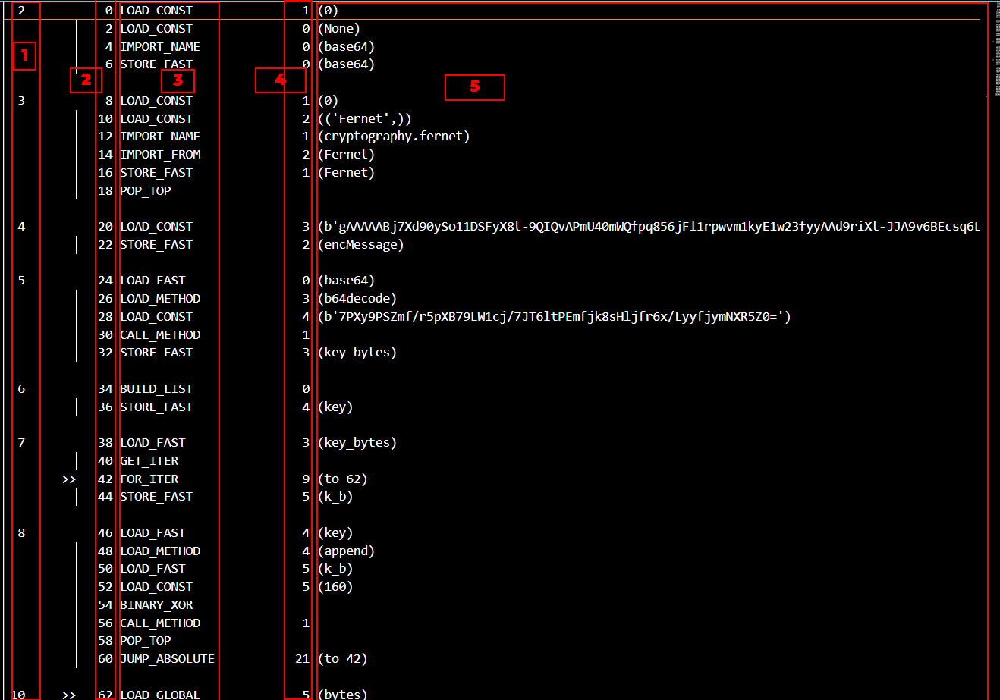
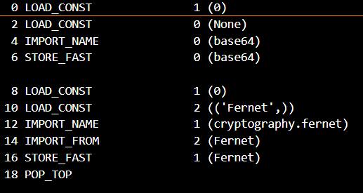
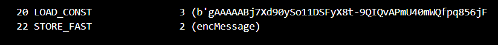
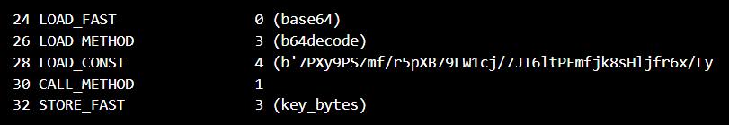
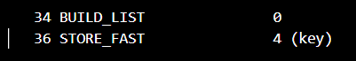
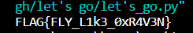

# Snake

Here I was given a text file on looking at, I recognazied that it's a python file exported as **manually_decompile.py**



those sections are easley eplaned as :
1- Section number — every section is separated with a spacebar and will be numbered accordingly.
Each section is a line in the original Python script.

2- Line number in the current section — this line number will be reset for every function.

3-Instruction — the instruction that will be executed.

4-Relevant to conditions — contains the line number where the condition ends.

5-Parameter —the relevant parameter according to the instruction.

here I tried to use **Uncompyle6** but there was a problem in magic bites of the original file generated 

first I tried to modify them but didn't work so easley made it manually using this documentation
 **"http://vega.lpl.arizona.edu/python/lib/bytecodes.html"** 

the translation is section by section -as said before- ever section is code line



here this easely translated into two import lines
```python
import base64
from cryptography.fernet import Fernet
```



this load a costant value (the flag) into a variable

```python
encMessage=b'gAAAAABj7Xd90ySo11DSFyX8t-9QIQvAPmU40mWQfpq856jFl1rpwvm1kyE1w23fyyAAd9riXt-JJA9v6BEcsq6LNroZTnjExjFur_tEp0OLJv0c_8BD3bg='
```



make variable (key_bytes) decode and assign its value using **base64**

```python
key_bytes = base64.b64decode(b'7PXy9PSZmf/r5pXB79LW1cj/7JT6ltPEmfjk8sHljfr6x/LyyfjymNXR5Z0=')
```


creat an empty list called key


make Var to loop into **key_bytes** then Xor the char and append it to the **key_list**

```python
for k_b in key_bytes:
    key.append(k_b^160)
```


then turn key into bytes


make a var **fernet** and call **Fernet** method with the key passed to it


that decrypts the message using **fernet** then store this in **decMessage**


Finally print the the flag and close the program 

```python
import base64
from cryptography.fernet import Fernet

encMessage=b'gAAAAABj7Xd90ySo11DSFyX8t-9QIQvAPmU40mWQfpq856jFl1rpwvm1kyE1w23fyyAAd9riXt-JJA9v6BEcsq6LNroZTnjExjFur_tEp0OLJv0c_8BD3bg='

key_bytes = base64.b64decode(b'7PXy9PSZmf/r5pXB79LW1cj/7JT6ltPEmfjk8sHljfr6x/LyyfjymNXR5Z0=')

key=[]

for k_b in key_bytes:
    key.append(k_b^160)

key=bytes(key)

fernet = Fernet(key)

decMessage = fernet.decrypt(encMessage).decode()

print(decMessage)
```
And here you are your flag



#### Written by

# *Karim Gomaa*